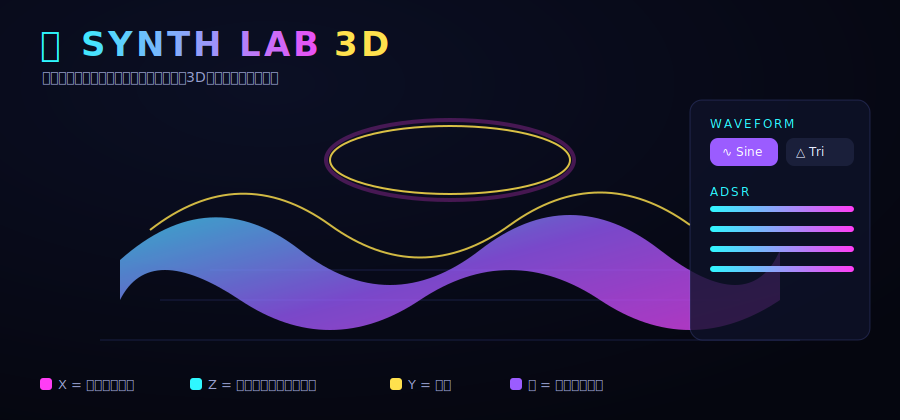

# 🎛️ Synth Lab 3D

シンセサイザーの **波形** や **ADSRエンベロープ（Decayなど）**、**フィルター** といった
パラメーターを動かすと、**音・波形・音色** がどう変化するのかを、カラフルで直感的な
**3Dアニメーション** でリアルタイムに体感できる学習用Webアプリです。

実際に **Web Audio API** で音が鳴り、その音を **Three.js** で 3D ビジュアライズします。



---

## ✨ できること

| パラメーター | 操作 | 3Dへの反映 |
|---|---|---|
| **波形 (Waveform)** | Sine / Triangle / Square / Saw を選択 | サーフェスの断面形状と **色（倍音の豊かさ）** が変化 |
| **Attack** | 立ち上がりの時間 | 時間軸(奥行き)手前の盛り上がり方 |
| **Decay** | 減衰の時間 | ピーク後の落ち込みカーブ |
| **Sustain** | 保持レベル | 中間の高さ |
| **Release** | 余韻の長さ | 奥に向かうフェードアウト |
| **Filter Cutoff** | 高域の量 | 色の明るさ・くすみ |
| **Resonance** | 共鳴 | 音色の強調 |
| **Pitch** | 音の高さ | 再生される音程 |

### 3D の見方（座標の意味）

- **X 軸** = 波形の位相（1周期の形が分かる）
- **Z 軸（奥行き）** = 時間。手前から奥へ ADSR エンベロープが進む
- **Y 軸（高さ）** = 振幅
- **色** = 倍音の豊かさ（Sine はクール系、Saw は暖色系）
- 中央で回転する黄色いリング = **実際に鳴っている音の波形**（オシロスコープ）

---

## 🚀 使い方

ビルド不要です。以下のいずれかで開いてください。

### かんたん（ローカルサーバー推奨）

ES モジュールを使っているため、ローカルサーバー経由での起動を推奨します。

```bash
# Python がある場合
python3 -m http.server 8000
# → ブラウザで http://localhost:8000 を開く
```

```bash
# Node がある場合
npx serve .
```

開いたら **「タップして開始」** をクリック（ブラウザの音声制限を解除するため）。

### 演奏方法

- **▶ デモ再生** … 1音を自動で鳴らす
- **⏺ ホールド** … 押している間だけ鳴らす（Release が分かりやすい）
- **PCキーボード** `A W S E D F T G Y H U J K` … ピアノのように演奏

> ※ Three.js は CDN（unpkg）から読み込みます。初回はインターネット接続が必要です。

---

## 🌐 GitHub Pages で公開する

完全な静的サイト（ビルド不要・パスはすべて相対参照）なので、そのまま GitHub Pages で
ホストできます。公開後の URL は `https://<ユーザー名>.github.io/<リポジトリ名>/` です。

### 方法 A: GitHub Actions で自動公開（推奨）

このリポジトリには `.github/workflows/deploy-pages.yml` を同梱しています。

1. リポジトリの **Settings → Pages** を開く
2. **Build and deployment → Source** を **「GitHub Actions」** に設定
3. 以降、`main` ブランチに push されるたびに自動でデプロイされます

### 方法 B: ブランチから直接公開（Actions 不要）

1. **Settings → Pages** を開く
2. **Source** を **「Deploy from a branch」** にする
3. Branch を **`main` / `(root)`** に設定して保存

どちらの場合も `index.html` がそのままトップページになります。

---

## 🧠 学べるポイント

- **波形の違い** が倍音（音の明るさ・リッチさ）と音色にどう効くか
- **ADSR** がどのように音量の時間変化（エンベロープ）を作るか
- **ローパスフィルター** が音の明るさをどう削るか

スライダーを動かしながら音を鳴らし、3D形状と色の変化を見比べてみてください。

---

## 🛠️ 技術構成

```
index.html        … 画面構造とUI
css/style.css     … ネオン調のスタイル
js/synth.js       … Web Audio API シンセエンジン（波形/ADSR/フィルター）
js/visualizer.js  … Three.js 3Dビジュアライザー（波形サーフェス・オシロ・パーティクル）
js/main.js        … UI とシンセ・ビジュアライザーの接続
```

- **Three.js 0.160.0**（importmap 経由で CDN 読み込み）
- **Web Audio API**（OscillatorNode → GainNode(ADSR) → BiquadFilter → Analyser）
- 依存パッケージのインストール不要・ビルド不要
